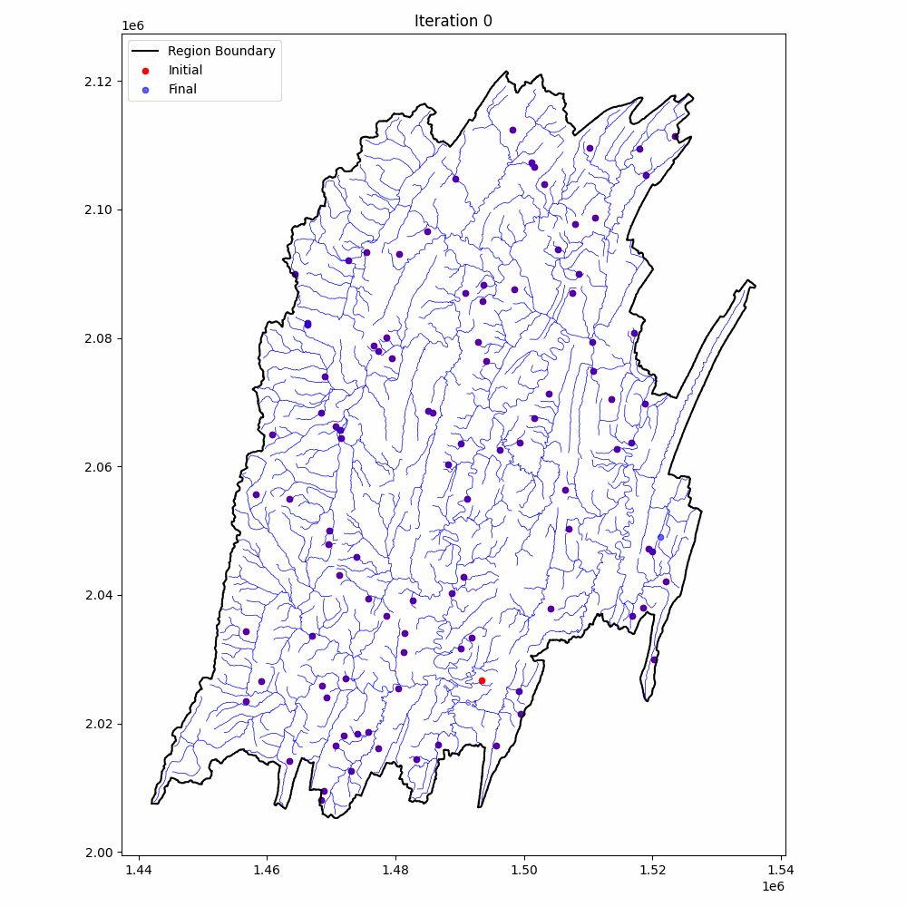
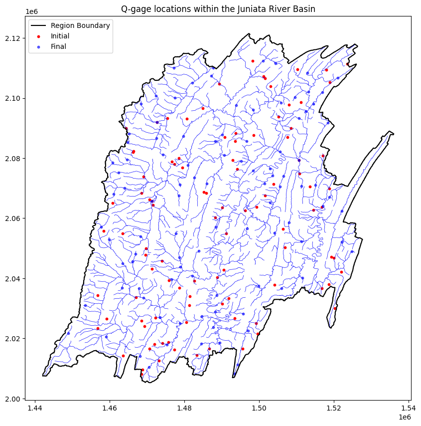
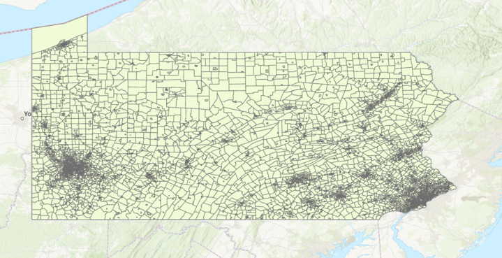
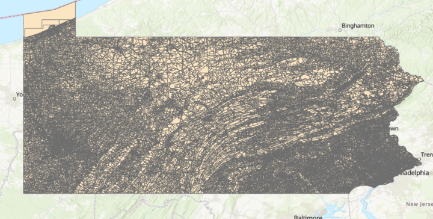
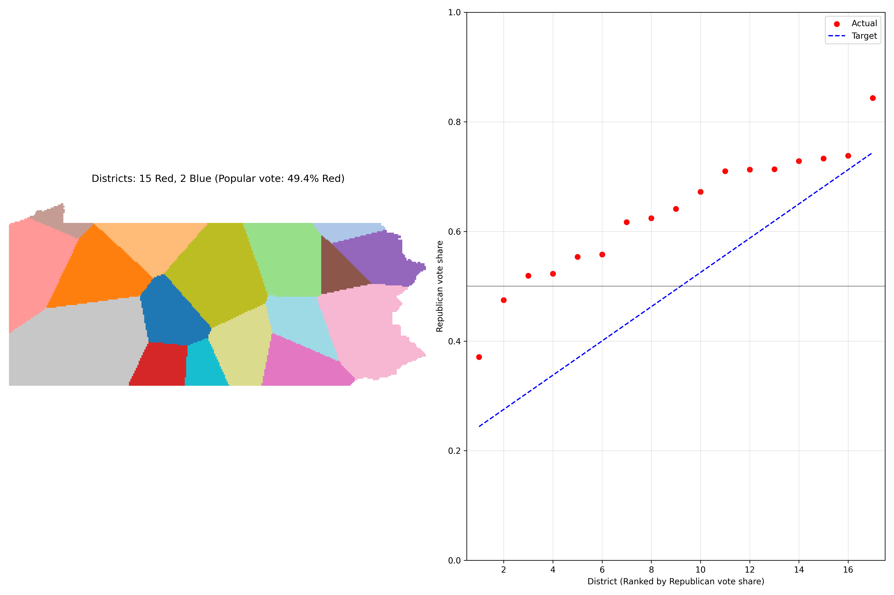
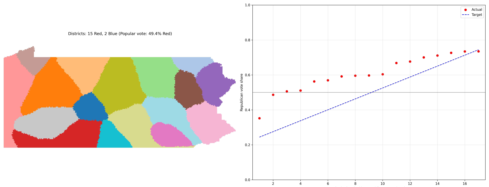

# SpatialForge
Markov Chain Monto Carlo Annealing

## Simple, Scalable Optimization

In the age of GenAI and big data, SpatialForge is simple stochastic optimization tool using a Morkov Chain Monte Carlo (MCMC) algorithm and simulated annealing designed to solve multi-objective, multi-dimensional geospatial tasks in a generic way.

Markov Chain Annealing in its simplest form is a stochastic guess and check method. For a generic optimization problem the process goes as follows:
1. A random guess is drawn from a Gaussian distribution.
2. If the guess satisfies given optimization constraints, accept the change. In the case of rejection, this algorithm includes a random chance for acceptance based on a defined probability (governed by a "temperature" variable). This temperature is reduced each iteration by a scheduler, reducing the probability to accept rejected changes. By enabling random chance for acceptance, MCMC annealing enables escape from local minima in the optimization.

We include two examples applying this tool: Optimal streamflow gage placement in Pennsylvania's Juniata river basin (JRB), and political redistricting for reducing gerrymander bias in Pennsylvania.

## Optimal Streamflow Gage Locations in the Juniata River Basin

We use MCMC annealing to learn the optimal placement of streamflow gages on rivers and streams in the JRB. Beginning from a random selection of gage locations, we optimize placement based on river location, geographic topology, and size of the stream/river (larger is more important).

### Optimization routine progresses as follows:

### Output

We output the results in an interactive HTML plot that can be viewed dynamically and also allows users to see the geolocations of the gages.

## Optimal Redistricting of Political Districts in Pennsylvania

MCMC annealing is used to adjust the coverage of the 17 political districts in PA, with the primary objective to reduce gerrymandering and increase election fairness. This optimization is further constrained by population size, compactness, and covered area.

Input data uses both PA voting districts and census blocks to determine population spread and voter affiliations:

#### Voting Districts

#### Census Blocks

### Optimization Routine

We begin with the current 17 districts for PA:

Our optimization method demonstrates an additional phasing scheme, wherein the algorithm first performs exploritory district modification, forming the fractals below

Following this, additional phases impose compactness constraints to reign in fractals and compose uniform boundaries for the districts

