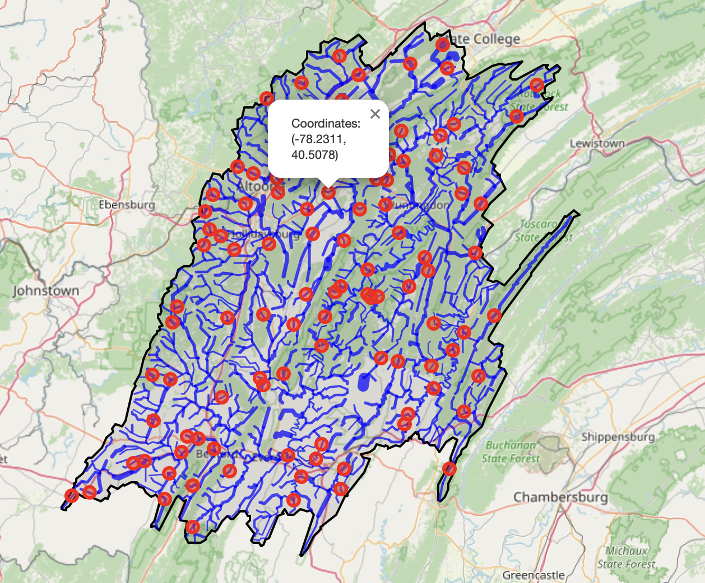

# SpatialForge
Markov Chain Monto Carlo Annealing 

In the age of GenAI and big data, SpatialForge is simple stochastic optimization tool  using a Morkov chain Monte Carlo (MCMC) algorithm and simulated annealing designed to solve multi-objective, multi-dimensional geospatial tasks in a generic way.

Markov Chain Annealing in its simplest form is a stochastic guess and check method. For a generic optimization problem the process goes as follows:
1. A random guess is drawn from a Gaussian distribution.
2. If the guess satisfies given optimization constraints, accept the change. In the case of rejection, this algorithm includes a random chance for acceptance based on a defined probability (governed by a "temperature" variable). This temperature is reduced each iteration by a scheduler, reducing the probability to accept rejected changes. By enabling random chance for acceptance, MCMC annealing enables escape from local minima in the optimization.

We include two examples for the application of this tool: Optimal streamflow gage placement in a hydrologic region, and state district optimization for reducing gerrymandered biases.

## Optimal Streamflow Gage Locations in the Juniata River Basin

Optimization routine progresses as follows:

We output the results in an interactive HTML plot that can be viewed dynamically and also allows users to see the geolocations of the gages.

